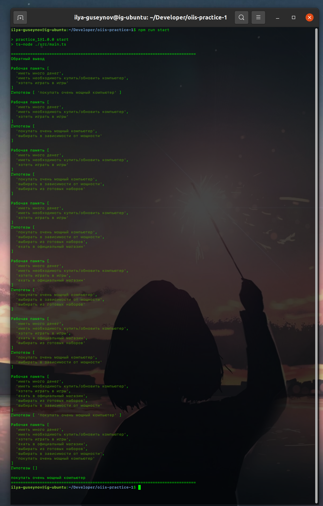
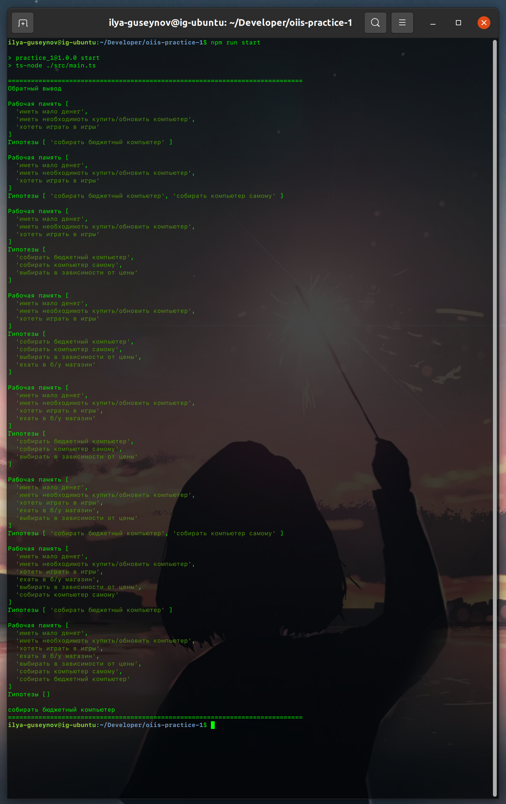

# ОИИС Практика 1

Реализовать прототип СОЗ, позволяющий осуществлять  прямой и обратный вывод, на любом языке программирования для ситуации: «покупка компьютера».

## Факты в системе

* иметь необходимоть купить/обновить компьютер
* хотеть играть в игры
* иметь много денег
* иметь мало денег
* ехать в официальный магазин
* ехать в б/у магазин
* выбирать из готовых наборов
* собирать компьютер самому
* выбирать в зависимости от цены
* выбирать в зависимости от мощности
* покупать очень мощный компьютер
* собирать бюджетный компьютер

## Правила в системе

* собирать компьютер самому и выбирать в зависимости от цены и ехать в б/у магазин то собирать бюджетный компьютер
* выбирать в зависимости от мощности и выбирать из готовых наборов и ехать в официальный магазин то покупать очень мощный компьютер
* выбирать в зависимости от цены и хотеть играть в игры то собирать компьютер самому
* выбирать из готовых наборов и хотеть играть в игры то выбирать в зависимости от мощности
* хотеть играть в игры и ехать в б/у магазин то выбирать в зависимости от цены
* хотеть играть в игры и ехать в официальный магазин то выбирать из готовых наборов
* иметь мало денег и иметь необходимоть купить/обновить компьютер то ехать в б/у магазин
* иметь много денег и иметь необходимоть купить/обновить компьютер то ехать в официальный магазин

## Результаты работы

### Случай 1

```bash
=============================================================================
Прямой вывод

Рабочая память [
  'иметь много денег',
  'иметь необходимоть купить/обновить компьютер',
  'хотеть играть в игры'
]

Рабочая память [
  'иметь много денег',
  'иметь необходимоть купить/обновить компьютер',
  'хотеть играть в игры',
  'ехать в официальный магазин'
]

Рабочая память [
  'иметь много денег',
  'иметь необходимоть купить/обновить компьютер',
  'хотеть играть в игры',
  'ехать в официальный магазин',
  'выбирать из готовых наборов'
]

Рабочая память [
  'иметь много денег',
  'иметь необходимоть купить/обновить компьютер',
  'хотеть играть в игры',
  'ехать в официальный магазин',
  'выбирать из готовых наборов',
  'выбирать в зависимости от мощности'
]

Рабочая память [
  'иметь много денег',
  'иметь необходимоть купить/обновить компьютер',
  'хотеть играть в игры',
  'ехать в официальный магазин',
  'выбирать из готовых наборов',
  'выбирать в зависимости от мощности',
  'покупать очень мощный компьютер'
]

покупать очень мощный компьютер
=============================================================================
```


### Случай 2

```bash
=============================================================================
Прямой вывод

Рабочая память [
  'иметь мало денег',
  'иметь необходимоть купить/обновить компьютер',
  'хотеть играть в игры'
]

Рабочая память [
  'иметь мало денег',
  'иметь необходимоть купить/обновить компьютер',
  'хотеть играть в игры',
  'ехать в б/у магазин'
]

Рабочая память [
  'иметь мало денег',
  'иметь необходимоть купить/обновить компьютер',
  'хотеть играть в игры',
  'ехать в б/у магазин',
  'выбирать в зависимости от цены'
]

Рабочая память [
  'иметь мало денег',
  'иметь необходимоть купить/обновить компьютер',
  'хотеть играть в игры',
  'ехать в б/у магазин',
  'выбирать в зависимости от цены',
  'собирать компьютер самому'
]

Рабочая память [
  'иметь мало денег',
  'иметь необходимоть купить/обновить компьютер',
  'хотеть играть в игры',
  'ехать в б/у магазин',
  'выбирать в зависимости от цены',
  'собирать компьютер самому',
  'собирать бюджетный компьютер'
]

собирать бюджетный компьютер
=============================================================================
```


### Случай 3

```bash
=============================================================================
Обратный вывод

Рабочая память [
  'иметь много денег',
  'иметь необходимоть купить/обновить компьютер',
  'хотеть играть в игры'
]
Гипотезы [ 'покупать очень мощный компьютер' ]

Рабочая память [
  'иметь много денег',
  'иметь необходимоть купить/обновить компьютер',
  'хотеть играть в игры'
]
Гипотезы [
  'покупать очень мощный компьютер',
  'выбирать в зависимости от мощности'
]

Рабочая память [
  'иметь много денег',
  'иметь необходимоть купить/обновить компьютер',
  'хотеть играть в игры'
]
Гипотезы [
  'покупать очень мощный компьютер',
  'выбирать в зависимости от мощности',
  'выбирать из готовых наборов'
]

Рабочая память [
  'иметь много денег',
  'иметь необходимоть купить/обновить компьютер',
  'хотеть играть в игры'
]
Гипотезы [
  'покупать очень мощный компьютер',
  'выбирать в зависимости от мощности',
  'выбирать из готовых наборов',
  'ехать в официальный магазин'
]

Рабочая память [
  'иметь много денег',
  'иметь необходимоть купить/обновить компьютер',
  'хотеть играть в игры',
  'ехать в официальный магазин'
]
Гипотезы [
  'покупать очень мощный компьютер',
  'выбирать в зависимости от мощности',
  'выбирать из готовых наборов'
]

Рабочая память [
  'иметь много денег',
  'иметь необходимоть купить/обновить компьютер',
  'хотеть играть в игры',
  'ехать в официальный магазин',
  'выбирать из готовых наборов'
]
Гипотезы [
  'покупать очень мощный компьютер',
  'выбирать в зависимости от мощности'
]

Рабочая память [
  'иметь много денег',
  'иметь необходимоть купить/обновить компьютер',
  'хотеть играть в игры',
  'ехать в официальный магазин',
  'выбирать из готовых наборов',
  'выбирать в зависимости от мощности'
]
Гипотезы [ 'покупать очень мощный компьютер' ]

Рабочая память [
  'иметь много денег',
  'иметь необходимоть купить/обновить компьютер',
  'хотеть играть в игры',
  'ехать в официальный магазин',
  'выбирать из готовых наборов',
  'выбирать в зависимости от мощности',
  'покупать очень мощный компьютер'
]
Гипотезы []

покупать очень мощный компьютер
=============================================================================
```



### Случай 4

```bash
=============================================================================
Обратный вывод

Рабочая память [
  'иметь мало денег',
  'иметь необходимоть купить/обновить компьютер',
  'хотеть играть в игры'
]
Гипотезы [ 'собирать бюджетный компьютер' ]

Рабочая память [
  'иметь мало денег',
  'иметь необходимоть купить/обновить компьютер',
  'хотеть играть в игры'
]
Гипотезы [ 'собирать бюджетный компьютер', 'собирать компьютер самому' ]

Рабочая память [
  'иметь мало денег',
  'иметь необходимоть купить/обновить компьютер',
  'хотеть играть в игры'
]
Гипотезы [
  'собирать бюджетный компьютер',
  'собирать компьютер самому',
  'выбирать в зависимости от цены'
]

Рабочая память [
  'иметь мало денег',
  'иметь необходимоть купить/обновить компьютер',
  'хотеть играть в игры'
]
Гипотезы [
  'собирать бюджетный компьютер',
  'собирать компьютер самому',
  'выбирать в зависимости от цены',
  'ехать в б/у магазин'
]

Рабочая память [
  'иметь мало денег',
  'иметь необходимоть купить/обновить компьютер',
  'хотеть играть в игры',
  'ехать в б/у магазин'
]
Гипотезы [
  'собирать бюджетный компьютер',
  'собирать компьютер самому',
  'выбирать в зависимости от цены'
]

Рабочая память [
  'иметь мало денег',
  'иметь необходимоть купить/обновить компьютер',
  'хотеть играть в игры',
  'ехать в б/у магазин',
  'выбирать в зависимости от цены'
]
Гипотезы [ 'собирать бюджетный компьютер', 'собирать компьютер самому' ]

Рабочая память [
  'иметь мало денег',
  'иметь необходимоть купить/обновить компьютер',
  'хотеть играть в игры',
  'ехать в б/у магазин',
  'выбирать в зависимости от цены',
  'собирать компьютер самому'
]
Гипотезы [ 'собирать бюджетный компьютер' ]

Рабочая память [
  'иметь мало денег',
  'иметь необходимоть купить/обновить компьютер',
  'хотеть играть в игры',
  'ехать в б/у магазин',
  'выбирать в зависимости от цены',
  'собирать компьютер самому',
  'собирать бюджетный компьютер'
]
Гипотезы []

собирать бюджетный компьютер
=============================================================================
```

